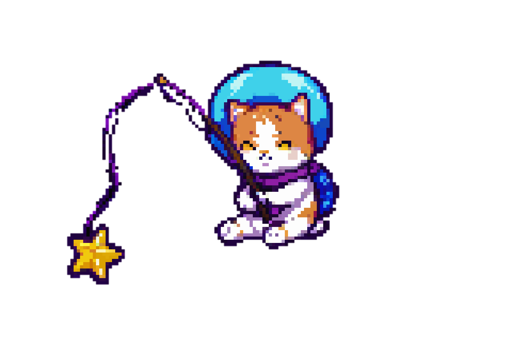

# 🚀🐱 Space Kitty - Star Rescue 🌟✨

---

### 📜 **The Cosmic Cat-tastrophe**  
Meet **Luna**, a curious kitten who accidentally launched herself into space! Now she’s on a mission to:  
- 🌠 Collect glowing stardust (while avoiding meteor showers ☄️)  
- 🏆 Beat her own high score (saved via SQLite magic 💾)  
- 🐾 Prove cats *do* land on their feet—even in zero gravity!  

---

## 🎮 **Gameplay**

- **Goal**: Survive as long as possible while collecting stars
- **Game Over**: When colliding with obstacles (but your score saves automatically!)
- **Controls**:  
  - Arrow Keys `↑ ↓ ← →` or `WASD` to dodge meteors  

---

### 📖 **Project Background**
Developed as part of my **Applied Programming** course at Uninter, this game demonstrates:
- Object-oriented programming principles
- SQLite database integration
- Pygame framework implementation
- Event-driven game design

  

